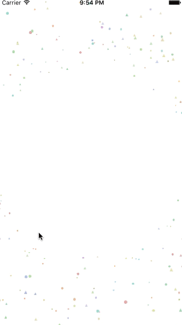

SummerWars
========================

[](https://developer.apple.com/swift/)

Summerwars is the view inspired by [Summerwars](https://www.youtube.com/watch?v=zFBrz3u8VkY).

## features
- can display like summerwars
- I don't think someone want to use this code, happy if this code make someone's help



## Requirements
- iOS 8.0+
- Swift 2.0+
- ARC

##Installation
- TODO

##Usage
example project would be easy to understand.
	
```swift
var contents = [WarsContent]()
for _ in 0..<30{
        let image = UIImage(named: "someimageYouWantToShow")
        let caption = "hello world"
        contents.append(WarsContent(image:image, caption: caption))
}

let summerWarsView = SummerWarsViewController(contents: contents)
addChildViewController(summerWarsView, toContainerView: view)
```

##Options
you can customize with some options
```
public struct SummerwarsOptions{
        // circle layer count
        public static var maxLayerCount 
        // one's max radius
        public static var warsMaxRadius:CGFloat 
        // one's min radius
        public static var warsMinRadius:CGFloat
        // one's central space radius
        public static var warsCentralRadius:CGFloat 
}
```

## License
available under the MIT license. See the LICENSE file for more info.

